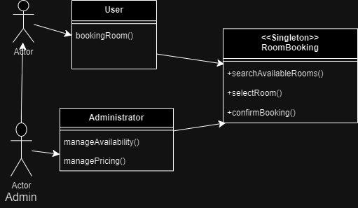

# Requirement Analysis in Software Development

## Introduction

Welcome to the **Requirement Analysis in Software Development** repository. This repository serves as a comprehensive foundation for understanding and executing the requirement analysis phase of the Software Development Life Cycle (SDLC). 

Through this project, we aim to:
- Master the principles of requirement gathering and analysis.
- Develop structured and precise documentation for a booking management system.
- Utilize tools like Draw.io for visual representations.
- Define functional and non-functional requirements along with acceptance criteria.

Stay tuned for detailed tasks and deliverables as we build a robust blueprint for a scalable software system!

## What is Requirement Analysis?

Requirement Analysis is a critical phase in the Software Development Lifecycle (SDLC) that involves gathering, analyzing, and defining the needs and expectations of stakeholders for a proposed software system. It serves as the foundation for the entire development process, ensuring that the final product meets the desired objectives and functions as intended.

### Key Aspects of Requirement Analysis:
1. **Understanding Stakeholder Needs**:
   - Identifies the goals and priorities of the end users, business stakeholders, and developers.
   - Ensures that all parties have a clear and shared understanding of the project's scope.

2. **Categorizing Requirements**:
   - **Functional Requirements**: Define the specific behaviors, features, and functionalities the software must perform.
   - **Non-Functional Requirements**: Address the quality attributes such as performance, scalability, security, and usability.

3. **Documentation and Communication**:
   - Converts vague ideas and needs into precise, structured documentation.
   - Provides a clear reference for the development team throughout the project.

### Importance in SDLC:
- **Minimizes Risks**: Reduces the risk of project failure by identifying potential challenges and ambiguities early in the process.
- **Ensures Alignment**: Aligns the project goals with business and user needs, preventing costly misunderstandings or rework.
- **Facilitates Planning**: Lays the groundwork for designing, developing, testing, and deploying the system.
- **Improves Quality**: Enhances the likelihood of delivering a product that meets expectations by ensuring clarity and precision in requirements.

Requirement Analysis is often referred to as the "blueprint" phase of software development, as it defines the project's roadmap and sets the stage for successful execution.

## Why is Requirement Analysis Important?

Requirement Analysis plays a pivotal role in the success of any software development project. By clearly defining and documenting the needs and expectations of stakeholders, it lays a solid foundation for building a reliable and efficient software system. Below are three key reasons why Requirement Analysis is critical in the Software Development Lifecycle (SDLC):

### 1. Prevents Miscommunication
Requirement Analysis bridges the gap between stakeholders and the development team by translating business needs into technical specifications. This ensures that everyone involved in the project has a shared understanding of the goals, minimizing the risk of costly misunderstandings or rework.

### 2. Enhances Project Planning
A thorough Requirement Analysis provides a clear roadmap for the development process. It enables teams to estimate resources, timelines, and budgets accurately, which is essential for effective project planning and execution.

### 3. Improves Product Quality
By identifying and documenting both functional and non-functional requirements, Requirement Analysis ensures that the final product meets the needs of users while adhering to quality standards like performance, security, and scalability. This results in a solution that delivers real value to stakeholders.

Requirement Analysis is the cornerstone of a well-structured development process. It not only guides teams through subsequent phases but also significantly increases the likelihood of delivering a successful and user-centered product.

## Key Activities in Requirement Analysis

The Requirement Analysis phase involves several key activities that ensure the success of a software development project. These activities help capture, clarify, and validate the expectations of stakeholders. Below are the five primary activities:

- **Requirement Gathering**:
  - Collect initial requirements from stakeholders such as clients, end-users, and business analysts.
  - Identify high-level goals and objectives for the software system.

- **Requirement Elicitation**:
  - Use techniques like interviews, workshops, questionnaires, and brainstorming sessions to uncover detailed requirements.
  - Engage with stakeholders to clarify expectations and address ambiguities.

- **Requirement Documentation**:
  - Organize the gathered and elicited requirements into clear and structured documents.
  - Use tools like Software Requirement Specifications (SRS) to create a central reference point.

- **Requirement Analysis and Modeling**:
  - Analyze requirements to ensure they are complete, consistent, and feasible.
  - Create visual models such as use case diagrams, data flow diagrams, and entity-relationship diagrams to illustrate system functionality and interactions.

- **Requirement Validation**:
  - Verify that documented requirements align with stakeholder expectations and project goals.
  - Conduct reviews, walkthroughs, and prototyping sessions to validate the feasibility and accuracy of requirements.

Each of these activities is critical to creating a strong foundation for the software development process. Together, they ensure that the final product is well-defined, aligned with stakeholder needs, and ready for implementation.

## Types of Requirements

In software development, requirements are broadly categorized into two types: Functional Requirements and Non-functional Requirements. Both are essential to ensuring the success of the project, as they address different aspects of the system.

### Functional Requirements

Functional Requirements define the specific behaviors and functionalities that the system must perform to meet user and business needs. These requirements describe *what* the system should do.

#### Examples for the Booking Management Project:
- Users should be able to create, view, modify, and cancel bookings.
- The system should allow administrators to manage room availability and pricing.
- Users must receive a confirmation email after successfully booking a room.
- The system should enable secure payment processing for bookings.

### Non-functional Requirements

Non-functional Requirements define the quality attributes, constraints, and operational characteristics of the system. These requirements describe *how* the system performs its functions.

#### Examples for the Booking Management Project:
- The system should handle up to 10,000 concurrent users during peak times.
- Booking confirmation emails should be sent within 5 seconds of a successful booking.
- The system must maintain 99.9% uptime to ensure reliability.
- All user data must be encrypted to comply with security standards.
- The platform should be accessible across mobile, tablet, and desktop devices.

Both types of requirements are crucial for the success of the project. Functional requirements ensure the system delivers the desired capabilities, while non-functional requirements guarantee usability, reliability, and scalability.

## Use Case Diagrams

Use Case Diagrams are a visual representation of the interactions between the actors (users or external systems) and the system. They illustrate the system's functionality from the user's perspective, making it easier to understand the scope and requirements.

### Benefits of Use Case Diagrams:
- **Clarity**: Provide a clear overview of the system's interactions and functionality.
- **Communication**: Serve as a tool to discuss and refine requirements with stakeholders.
- **Focus**: Highlight the roles of different actors and their associated tasks, ensuring comprehensive coverage of requirements.

### Use Case Diagram for the Booking Management System

Below is the Use Case Diagram illustrating the interactions between actors (User and Administrator) and the booking system:

